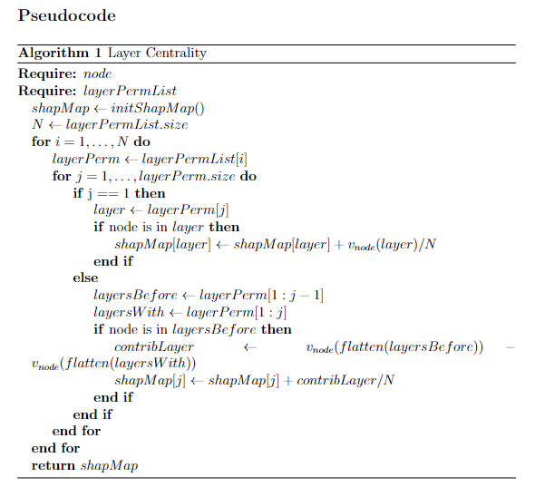

# Layer Centrality

Layer centrality is an interesting topic in the field of network analysis. It can be useful in analysing different social, political, economical and many other types of multilayered networks. There is a constant increase in the development and daily usage of multiple technologies and as a consequence, more and more chunks of data are stored each day resulting in complex datasets, with large numbers of entries and multiple attributes, which can offer valuable information by conducting an efficient analysis. Many datasets can be modeled as multilayered networks, where each layer contains some information regarding its nodes. The proposed approach offers a method of analysing the importance of a layer with respect to a node in a multilayered network. This can be useful when trying to understand how much a layer influenced a certain node in the multilayered network.

The proposed layer centrality analysis works with the following setup:
- Multilayered network, where each layer is represented by an undirected graph.
- Additive centrality measures used to determine the layer centrality.

## Master Thesis - Layer Centrality in Multilayered Networks

The algorithm which is proposed in [Layer Centrality in Multilayered Networks](http://localhost/documents/layer_centrality_in_multilayered_networks.pdf) aims at providing an efficient method of determining the influence of a layer with respect to a node in a multilayered network. It was developed during the master thesis of [Victor Bogdan](https://scholar.google.com/citations?user=eeKVSEwAAAAJ&hl=en&oi=ao) under the coordination of [Gabriel Istrate](https://scholar.google.com/citations?user=KmuHvIwAAAAJ&hl=en&authuser=2&oi=ao) and [Cosmin Bonchis](https://scholar.google.com/citations?user=p2XrjbAAAAAJ&hl=en&authuser=2&oi=ao) at the West University of Timisoara, Faculty of Mathematics and Informatics.

### Methodology

Our approach is rooted in the principles of additive centrality measures and [Shapley Value](https://www.rand.org/pubs/papers/P295.html), with the latter requiring an adaptation of the context in order to accommodate the integration of techniques from game theory. By representing the data as a multilayered network, we can regard each layer as an agent, thereby adapting our context by creating a game between these layers. In order to compute the contribution of each layer to a specific node, we can conceive of all layers as forming a coalition. The initial contribution of each layer is established through the application of centrality measures to the layers of the multilayered network. Through the computation of the Shapley Value, we will obtain a vector of values which represents the contribution (centrality) of each layer in relation to a node. Consequently, similar to the case of centrality measure functions for single-layered networks, which determine the centrality of nodes, our approach can be utilized to determine the centrality of layers within a multilayered network.

The additive centrality measures which we have used are:
- [Degree centrality](https://networkx.org/documentation/stable/reference/algorithms/generated/networkx.algorithms.centrality.degree_centrality.html), which quantifies the number of edges a node has in a network.
- [Katz centrality](https://networkx.org/documentation/stable/reference/algorithms/generated/networkx.algorithms.centrality.katz_centrality.html), which calculates the centrality of a node based on the sum of the weights of the paths between the node and all other nodes in the network.
- [Subgraph centrality](https://networkx.org/documentation/stable/reference/algorithms/generated/networkx.algorithms.centrality.subgraph_centrality.html), which evaluates the importance of a node by counting the number of subgraphs that include that node.
- [Harmonic centrality](https://networkx.org/documentation/stable/reference/algorithms/generated/networkx.algorithms.centrality.harmonic_centrality.html), which assesses the importance of a node by computing the sum of the harmonic mean of the distances of that node to all other nodes in the network.

By using the previously described adaption to a game, the Shapley Value has a great significance in providing a fair way of distributing the rewards, in our case represented by the influence of each layer for a node. It is a solution concept for the fair distribution of both costs and gains to multiple agents that are part of a coalition. The Shapley Value can ultimately be interpreted as the average expected marginal contribution of a single agent, after all possible combinations have been taken into consideration.

The computation of layer centrality values for a given multilayered network using our approach necessitates a series of specific procedures. Initially, we compute all combinations of all possible lengths of the layers. For each combination of layers, we flatten the layers in order to avoid duplicate connections. For a given node n, we subsequently compute its centrality on each of the resulting flattened layers. Finally, we compute the Shapley value, utilizing the centrality that we obtained in the preceding step for each flattened layer. In this manner, we are able to establish the centrality of each layer for a given node n.

### Remarks

Determining the layer centrality in multilayered networks can be a challenging task, especially when trying to offer a flexible solution. Our proposed approach is mainly designed for multilayered networks which have undirected graphs as layers. Each centrality measure offers a different method of interpreting the influence of a node in a graph, in our case the influence of a layer with respect to a node. Therefore, by using different centrality measures and adapting the context in order to use the Shapley Value, we have obtained different results, computed in a fair way, which also offered different perspectives when interpreting those results.

## Dataset

The algorithm we have proposed has undergone a thorough examination utilizing the AUCS dataset procured from [UUNET](http://multilayer.it.uu.se/software.html), which is a Python-based version of a multinet library originally developed in the R programming language. Credit for this library should be attributed to Matteo Magnani, his colleagues and their research: [Multilayer Social Networks](https://pure.itu.dk/en/publications/multilayer-social-networks).

The AUCS dataset comprises five layers, one of which pertains to digital social connections on the Facebook platform, and the remaining layers, Coauthor, Leisure, Lunch, and Work, pertain to real-life social connections. Each layer is represented by an undirected network, and all layers collectively construct a social multilayered network. The dataset contains 61 unique nodes, which are anonymous employees from the research department of a university that is not mentioned. Each employee is present on one or more of these layers and can have a varying number of connections, ranging from zero to multiple.
